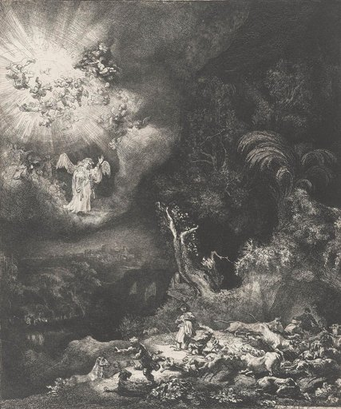
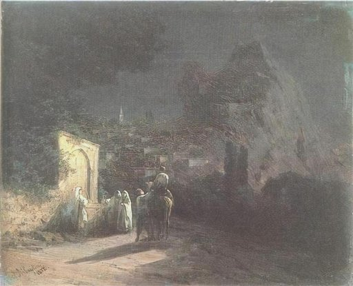
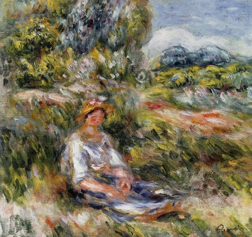
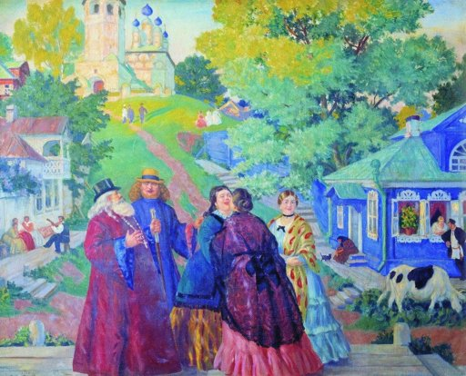

# Assignment 2: Schema-Guided WikiArt Classification

## 사용한 모델

`nvidia/nemotron-3-nano-omni-30b-a3b-reasoning:free` via OpenRouter API

## 실행 방법

```bash
pip install -r requirements.txt

# .env 파일에 토큰 설정
# OPENROUTER_TOKEN=your_token_here

python classify_wikiart.py
```

주요 옵션:

| 옵션 | 기본값 | 설명 |
|------|--------|------|
| `--limit` | 20 | 분류할 이미지 수 |
| `--model` | nvidia/nemotron-3-nano-omni-30b-a3b-reasoning:free | 사용할 모델 |
| `--retries` | 2 | API 실패 시 재시도 횟수 |
| `--timeout` | 60.0 | 요청 타임아웃 (초) |
| `--output-html` | results.html | HTML 결과 파일 경로 |

## Claude Code에 준 주요 지시문

```
이 레포에서 assignments/assignment2/README.md 여기 보면 과제에 대한 내용이 있고, submissions/2025122/assignment2 여기에 과제에 대한 예시가 나와있어. 이걸 바탕으로 submissions/202400190/assignment2 폴더 안에 과제물을 생성해. huggan/wikiart 데이터셋에서 이미지 20개를 가져와 openrouter API를 이용해 schema-guided decoding을 활용한 image classification을 할 거야. 기본적인 task는 has_human/has_animal/has_flower에 대해서 답하고, 그 판단 근거를 자연어로 짧게 작성하는데 center, top-left, foreground 와 같은 위치 표현을 포함하도록 하는 거야.
```
```
API 오류로 실패한 샘플이 생기면 전체를 다시 돌리지 않고 results.json에서 error 항목만 찾아 이미 저장된 이미지를 재활용해서 분류를 다시 시도해보고, results.json이나 results.html을 자동으로 덮어쓰는 코드를 작성해줘.
```

## 결과에서 흥미로웠던 사례

1. 
```
"labels": {
    "has_human": "yes",
    "has_animal": "yes",
    "has_flower": "no",
    "evidence": "A human figure is visible in the lower center foreground, and several animals, including sheep and possibly a dog, are scattered in the lower right foreground; no flowers are visibly present in the image."
    }
```
모델의 답변을 보면 이미지의 오른쪽 아래 부분에서 사람과 동물을 구분해서 찾아냈는데, 확대해서 자세히 보아도 구분이 어려운데 모델이 양인지 개인지도 구분하고 있어서 놀랍다.

2. 
```
"labels": {
    "has_human": "yes",
    "has_animal": "yes",
    "has_flower": "no",
    "evidence": "There are several human figures visible, including a person riding a donkey in the center foreground and others standing near a stone structure on the left; there is a donkey (an animal) present, but no flowers are visible in the scene."
    }
```
"donkey"라고 지칭한 동물이 전형적인 말이나 당나귀의 형상이 아니라는 생각이 드는데, (대체로 측면이나 정면을 떠올리지 않을까 싶음.) 동물의 뒷모습을 보고도 구분해낸 것이 신기하다.

3. 
```
"labels": {
    "has_human": "yes",
    "has_animal": "no",
    "has_flower": "yes",
    "evidence": "A human figure is visible in the center foreground wearing a hat, and flowers are present in the top-left background."
    }
```
그림이 전체적으로 형태가 일그러져 있고, 꽃의 형태도 분명하게 나타나지 않는데 꽃이 있다고 판단한 것이 흥미롭다.


## 모델이 헷갈렸거나 틀렸다고 생각되는 사례

1. 
```
"labels": {
    "has_human": "no",
    "has_animal": "no",
    "has_flower": "yes",
    "evidence": "A human figure is visible in the foreground center, interacting with others; an animal (cow) is in the lower right; a flower is visible in a window box on the blue house in the background."
}
```
evidence에서는 "A human figure is visible..."이라고 말하며 사람이 있음을 인지하고 있지만 위에 has_human 값은 "no"라고 되어 있다. 마찬가지로 "an animal (cow)"라고 말하고 있지만, has_animal 값은 "no"이다. evidence를 먼저 생성하게 된다면 이런 모순이 덜할까?...

2. 
```
"labels": {
    "has_human": "no",
    "has_animal": "yes",
    "has_flower": "no",
    "evidence": "A human figure is not clearly visible, but several animals, likely sheep or cows, are present in the foreground and mid-ground, with a group on the right side illuminated by moonlight."
    },
```
사람이 분명하게 나타나진 않지만, 소들 사이에 우뚝 솟아있는 형상이 사람으로 보인다. 나무 왼쪽 아래, 그리고 오른쪽 소들 사이에서도 보이는데 모델이 잡아내지 못한 것이 아쉽다.