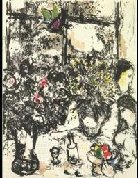
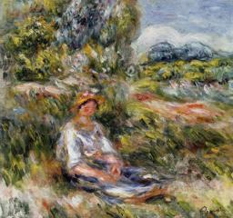

# Assignment 2: Schema-Guided WikiArt Classification

## 사용한 모델

`nvidia/nemotron-3-nano-omni-30b-a3b-reasoning:free` via OpenRouter API

## 실행 방법

```bash
pip install -r requirements.txt

# .env 파일에 토큰 설정
# OPENROUTER_TOKEN=your_token_here

python classify_wikiart.py
```

주요 옵션:

| 옵션 | 기본값 | 설명 |
|------|--------|------|
| `--limit` | 20 | 분류할 이미지 수 |
| `--model` | nvidia/nemotron-3-nano-omni-30b-a3b-reasoning:free | 사용할 모델 |
| `--retries` | 3| API 실패 시 재시도 횟수 |
| `--timeout` | 60.0 | 요청 타임아웃 (초) |
| `--output-html` | results.html | HTML 결과 파일 경로 |

## Prompts

```
README.md를 참고해서 과제 파일을 생성할거야. image classification을 해야 하는데, human, animal, flower의 여부를 yes, no로 알려주고, 그 판단 근거를 간단히 설명해야해. 근거를 생성할 때에는 center, top-left, bottom-right와 같은 위치 표현을 사용해.
```
```
에러로 JSON object가 NoneType가 아니라 must be str, bytes or bytearray가 되어야 한다는 것과, timeout가 발생했는데, error, timeout가 발생하지 않도록 수정해줘. 근거를 설명할 때는 언어는 영어, 아랍어 등 다른 언어를 섞지 말고 한국어만 사용해서 생성해.
```
- Timeout 10초, retries도 없는 상태였고 json을 보니 여러 나라의 언어로 설명이 생성되어 있어서 수정하기 위한 프롬프트. (그러나 최종 json에서도 영어, 한자를 여전히 사용했고, 여전히 timeout이 발생하긴 했음.)

## 결과에서 흥미로웠던 사례

1. 
```
  {
    "id": 15,
    "image_path": "images/image_15.jpg",
    "has_human": "yes",
    "has_animal": "yes",
    "has_flower": "yes",
    "reasoning": "꽃은 좌측에 있는 다발의 꽃들(분홍색 점)이 보입니다. 동물은 중앙 상단에 있는 새 모양의 그림(검정색 몸체에 초록색 날개)이 보입니다. 사람은 우측에 그려진 인물들(노란색 얼굴과 검은색 몸체)이 보입니다."
  },
```
전반적으로 그림이 추상적이다, 그래도 형상을 보고 사람, 꽃, 동물을 판별한 것이 신기하다.

2. 
```
  {
    "id": 7,
    "image_path": "images/image_7.jpg",
    "has_human": "yes",
    "has_animal": "yes",
    "has_flower": "no",
    "reasoning": "사람: 좌측 먼 거리에 작은 인물이 보입니다. 동물: 우측 하단에 동물들이 보입니다. 꽃: 화면에는 꽃이 없습니다."
  },
```
전반적으로 어두운 그림인데 사람과 동물 형태의 그림자가 있다는 것을 정확히 판별해서 신기했다.

3. 
```
  {
    "id": 18,
    "image_path": "images/image_18.jpg",
    "has_human": "yes",
    "has_animal": "yes",
    "has_flower": "no",
    "reasoning": "The image contains a group of people (humans) on the left side and a horse (animal) on the right side. The first row of text mentions 'human' and 'animal', so the answer is 'yes' for both."
  },
```
그림이 흐릿한데도 사람과 가축을 구분을 잘 했다.


## 모델이 헷갈렸거나 틀렸다고 생각되는 사례

1. 
```
    {
    "id": 3,
    "image_path": "images/image_3.jpg",
    "has_human": "yes",
    "has_animal": "no",
    "has_flower": "no",
    "reasoning": "인간 – 중앙 하단에 앉아 있는 여성 인물이 보입니다. 동물 –画 전체에 동물은 전혀 나타나지 않습니다. 꽃 – 좌측 상단과 배경의 녹색 식물은 있지만 구체적인 꽃은 없습니다."
  },
```
해상도가 높지는 않지만, 사람 주위 배경에 꽃이 있다. 식물에 붉은 부분이 있지만, 녹색이 많다고 해서 꽃이 없다고 판별한 것 같다.

2. 
```
  {
    "id": 5,
    "image_path": "images/image_5.jpg",
    "has_human": "yes",
    "has_animal": "yes",
    "has_flower": "no",
    "reasoning": "사람: 중앙에 여러 명이 모여 conversation 중.\n동물: 우측 하단에 검은색과 흰색 소가 서 있다.\n꽃: 꽃은 화면에 명시적으로 나타나지 않음."
  },
```
좌하단에 사람 옆에 있는 식물에 꽃이 포함되어 있음을 알 수 있다. 해상도가 높은 그림은 아니지만, 풀 근처에 있는 꽃을 판별하지 못했다.
