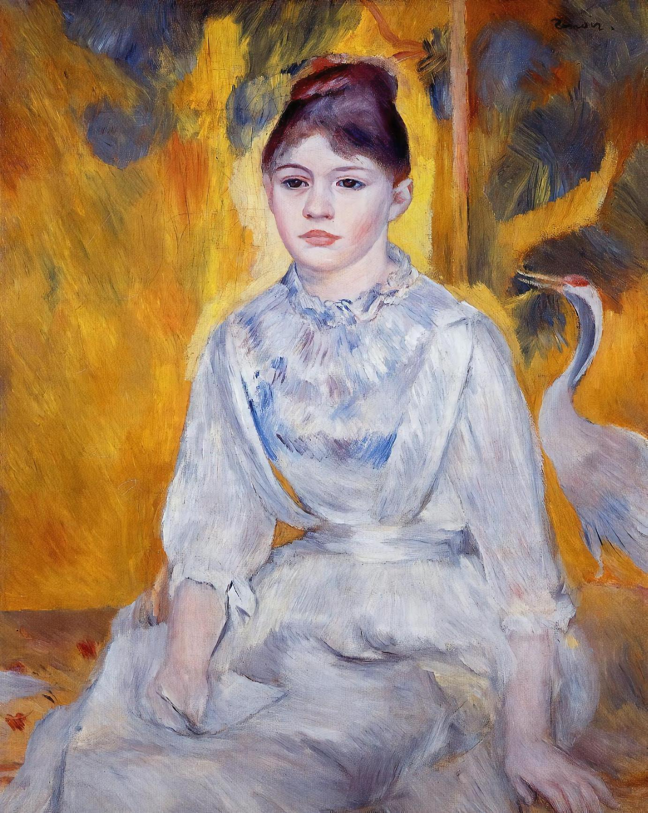
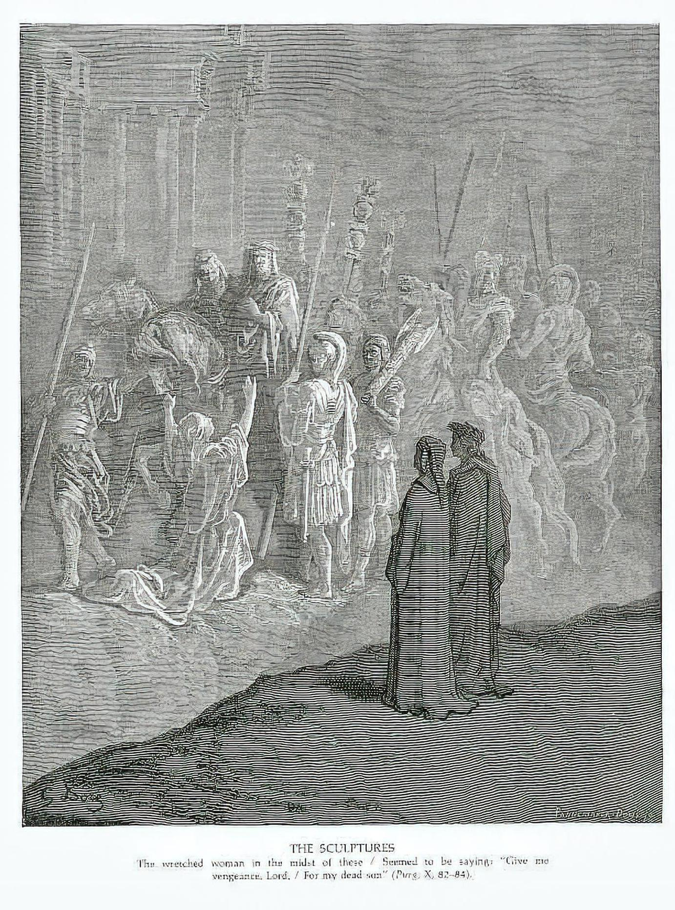

# Assignment 2

**Language & AI 융합전공 202402050 최재원**

---

## 사용한 모델

**nvidia/nemotron-3-nano-omni-30b-a3b-reasoning:free**
> 할당량을 모두 사용하여 `nvidia/Nemotron-3-Nano-Omni-30B-A3B-Reasoning-BF16`를 서빙해 사용함

---

## 실행 방법

### 1. 환경 설정
```bash
conda create -n mm-ass2 python=3.11
conda activate mm-ass2
pip install -r requirements.txt
```

### 2. API 키 설정
`.env`에 OpenRouter API 토큰 설정:
```
OPENROUTER_TOKEN=<token>
```

### 3. 코드 실행
```bash
python classify_wikiart.py
```

---

## Agentic Coding 도구에 준 주요 지시문

### 지시문 1 / 2: 가능한 모든 내용을 포함해 지시

```
HF datasets `huggan/wikiart`의 초기 100개를 선택해 human, animal, flower의 세 가지가 존재하는지 분류해야 해
has_human, has_animal, has_flower에 대해 `yes`나 `no`로만 분류 및 `reason`에 판단 근거를 제시하도록 schema-guided decoding을 활용해야 해
이를 위한 프롬프트에 `center`, `foreground`, `background` 등의 위치 표현을 포함하도록 해주고, `has_human`, `has_animal`, `has_flower`의 의미를 명확히 설명하도록 해줘
이를 위한 MLLM으로, `nvidia/nemotron-3-nano-omni-30b-a3b-reasoning:free`를 OpenRouter API로 사용할 거고, API 키는 .env에 `OPENROUTER_TOKEN`으로 있어
conda 환경으로 `mm-ass2`를 만들어 사용하고, requirements.txt에 사용된 패키지들을 버전과 함께 명시해줘
샘플은 20개로 제한해 분류하고, 결과를 `results.html`에 시각화해주고, assets는 `images/` 폴더에 저장해주는 파이썬 스크립트를 `classify_wikiart.py`에 작성해주면 돼
OpenRouter 구현은 아래를 참고해
(ref: https://openrouter.ai/nvidia/nemotron-3-nano-omni-30b-a3b-reasoning:free/api - OpenAI SDK)
```
> 과제 내용 이해 및 기본 구현을 위함

### 지시문 2 / 2: 불필요한 구조 제거

```
병렬 처리는 필요 없고, JSON 형태로 반환하지 못한 경우나 Timeout 등에 대해서는 다시 시도하도록 해줘
```
> 멀티쓰레딩으로 구현된 복잡한 구조를 덜어내고, 어쨌든 모든 샘플에 대해 획득할 수 있도록 수정하고자

---

## 결과에서 흥미로웠던 사례 3개

### 사례 1
<div align="center">
    
</div>

> 처음 봤을 때 꽃이 없는 것처럼 보였는데, 모델의 `reason`을 보고 다시 보니 파란 집 창문에 꽃이 있는 것을 알 수 있었음

### 사례 2
<div align="center">
    
</div>

> 얼굴만 봤을 때는 사람보다 원숭이에 가까운데, 모델은 사진 내의 전반적인 특징을 통해 해당 객체가 사람이라고 인식한 것으로 보임

### 사례 3
<div align="center">
    
</div>

> 구름이 마치 새가 날아가는 것처럼 보이나, 모델은 이를 오해하지 않고 `has_animal`을 `no`로 정확히 예측함

---

## 모델이 헷갈렸거나 틀렸다고 생각되는 사례 2개

### 문제 사례 1
<div align="center">
    
</div>

> 좌측 하단에 빨간색이 꽃으로 보이는데, 모델은 `has_flower`를 `no`로 예측했으며, `reason`으로 `No flowers are present in any part of the image.`라고 제시함

### 문제 사례 2
<div align="center">
    
</div>

> 사람이 있는 것은 제대로 인식했는데, 해안가에 사람이 3명(어른 둘에 아이 하나) 그리고 배에 타고 있는 사람이 2명(노를 젓는 사람과 그를 안고 있는 사람)이 보여 적어도 5명이 존재하는데, 모델은 `reason`으로 `In the foreground, three human figures are visible on the shore and in a small boat.`라고 제시함

### 문제 사례 3
<div align="center">
    
</div>

> 확실하지 않지만, 좌측에 말이 있는 것으로 보이며 모델은 동물이 없는 것으로 예측함
